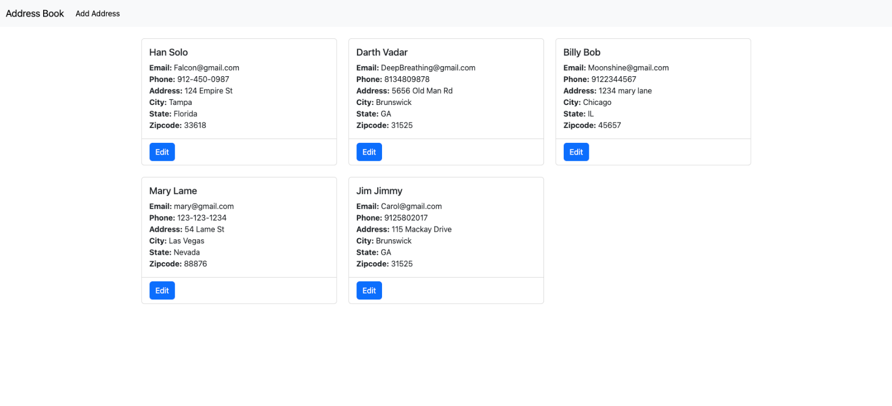
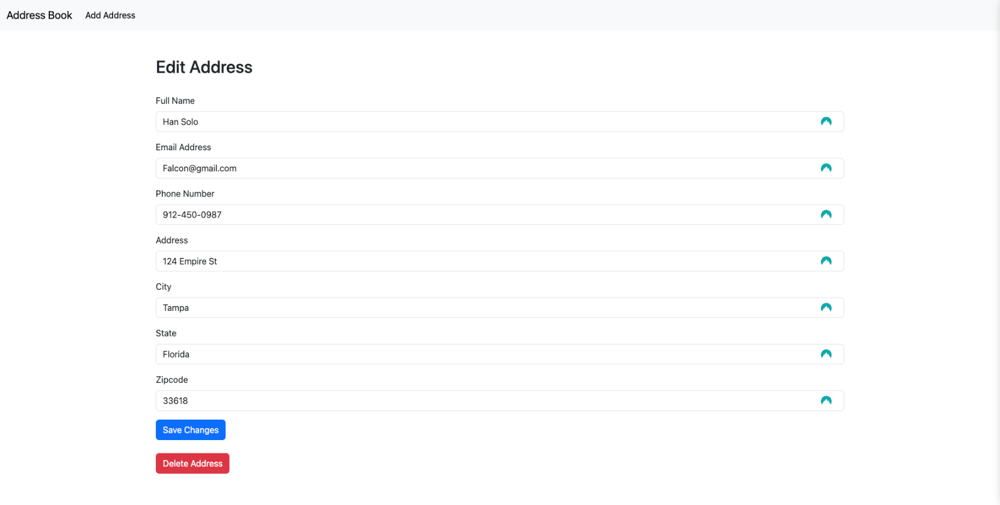
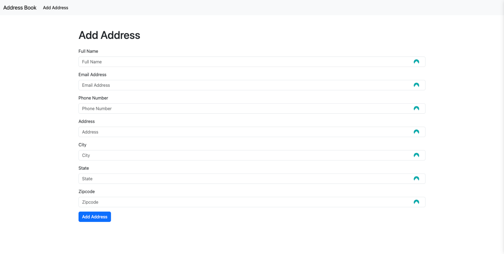

<h1>Address Book!</h1>

[contributors-shield]: https://img.shields.io/badge/contributors-_1-blue?style=for-the-badge
[contributors-url]: https://github.com/drewkybrown/Address-Book/graphs/contributors

 

<!-- TABLE OF CONTENTS -->

    
Table of Contents

    <ul>
        <li><a href="#about-the-project">About The Project</a></li>
        <li><a href="#screenshots-and-wireframe">Screenshots</a></li>
        <li><a href="#technologies-used">Technologies Used</a></li>
        <li><a href="#getting-started">Getting Started</a></li>
        <li><a href="#key-features">Key Features</a></li>
        <li><a href="#next-steps-and-future-enhancements">Next Steps and Future Enhancements</a></li>
        <li><a href="#contact">Contact</a></li>
    </ul>

## About the Project

I have developed a fully-featured Django address book application that incorporates complete CRUD (Create, Read, Update, Delete) functionalities, designed to manage contact information effectively. This application stands out due to its utilization of a robust stack of technologies and deployment on Heroku, making it accessible anywhere.

## Screenshots 

## Technologies Used

## Getting Started

🚀 Explore Address Book!!: https://agile-meadow-70697-aedee706a193.herokuapp.com/

## Key Features

## Full CRUD Functionality
- Create: I can add new entries to my address book, capturing essential details like name, email, phone number, address, city, state, and zipcode.
- Read: I enable users to browse through all stored contacts in the address book, with options to view detailed information for each contact.
- Update: I provide the capability to edit the information of existing contacts, ensuring the address book remains up-to-date.
- Delete: I allow users to remove outdated or unnecessary contacts, maintaining the relevance and cleanliness of the database.

##Responsive Web Interface
- My application features a responsive web design, utilizing Django templates potentially enhanced with Bootstrap for styling. This ensures a seamless user experience across different devices and screen sizes.

## Database Integration with PostgreSQL
- Leveraging `psycopg2` and `dj-database-url`, my app connects to PostgreSQL for robust and secure data storage. This choice supports the efficient management of the address book's data, offering scalability and reliability.

## Environment and Configuration Management
- Through the use of `python-decouple` and `python-dotenv`, I manage environment variables and application configurations outside the codebase. This practice enhances the security of my application by safeguarding sensitive information such as database credentials.

## Deployment Ready for Heroku
- My address book application is deployed on Heroku, made seamless by `django-heroku` and `gunicorn`. `Whitenoise` serves static files efficiently, ensuring optimal performance. The deployment process is streamlined, making the application accessible from anywhere with internet access.

## Asynchronous Support
- With `asgiref`, my application supports asynchronous operations, which enhances its performance by enabling non-blocking database calls and potentially integrating external API requests efficiently.

These features demonstrate the capabilities and flexibility of my Django address book application, highlighting my focus on creating a user-friendly, secure, and accessible tool for managing contact information.

## Next Steps and Future Enhancements

1. Enhanced Search and Filtering:** Introduce advanced search capabilities with autocomplete suggestions to quickly find specific contacts.
2. User Authentication and Authorization:** Implement secure signup, login, and access control to protect user data and ensure privacy.
3. Contact Grouping and Tags:** Enable users to categorize and tag contacts for easier organization and retrieval.
4. Data Export and Import:** Facilitate the seamless migration of contact data across platforms with support for common file formats like CSV and JSON.
5. Account Recovery Options:** Provide secure methods for users to recover access to their accounts, enhancing trust and security.

## Contact

Andrew Brown  

(<a href="#readme-top">back to top</a>)

